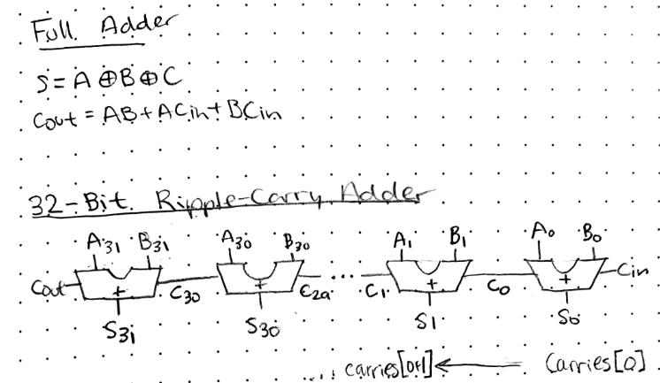
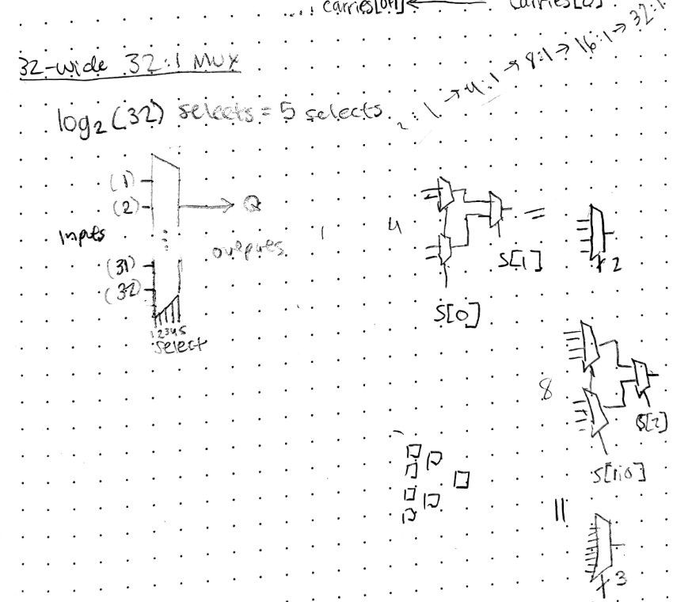

# HW4.2) Combination Logic Review and HDL Practice: ALU
## **The Problem Solution**
### ***The Adder* : 32-bit Wide Adder**

The main idea of creating the 32-bit wide adder is by connecting 32 full adders. With one full adder, the sum of two bits A and B, and carry C, is S = A xor B xor C. To find the carry out value C_out, with input carry C as C_in, is C_out = (A and B) or (A and C_in) or (B and C_in). So, to add 32 pairs of bits, we add each pair of bits and use the new C_out as a C_in carry for the next summation. This is better shown in the notes below.

To do this, the 32-bit ripple carry was generated. Each `full_adder` module is assigned an `a` value, a `b` value, a `c_in` value from the prior `c` value, the `y` specific sum value, and the next `c` or c_out value. This is all written out in `add32.sv`.

### ***The MUX* : 32-bit Wide 32:1 MUX**

The MUX example was a little more complicated. It starts with the 2:1 mux as written out in `mux2.sv`. Both inputs are stored in `D` as a 64-bit wide wire, the select `S`, and a 32-bit wide output `Y`. So, one of the two inputs is chosen with the selector, and one of the two inputs are selected. For the 2:1 Mux, we assign Y as either `D[63:32]` with the select 0 input, or `D[31:0]` with the select 1 input, leading to a 32-bit wide `Y` value.

To build the 32:1 MUX, we will MUX each pair of MUXes, each as building blocks for the next step. Essentially, 2:1 MUXes will help define 4:1 MUXes, will help 8:1 MUXes, will help 16:1 MUXes, and finally help define the 32:1 MUX. So, we set up `mux2.sv`, which is utilized in `mux4.sv`, used in `mux8.sv`, used in `mux16.sv`, and finally `mux32.sv`. Each new input is defined to be 32 bits. Each new iteration adds a new select, and each iteration includes two building blocks with an out of length 32 bits each, leading to a 2:1 MUX choosing between the outputs of the building blocks. This is best depicted in the diagrams below, which show a 4:1 MUX made of 2:1 MUXes, and an 8:1 MUX made of 4:1 MUXes and 2:1 MUX, and so on.

*IMO: For best understanding, look back at the 4:1 MUX diagram and 8:1 MUX diagram, and compare that to the code in `mux2.sv`, `mux4.sv` and `mux8.sv`. This is further explained below.*

Also as shown in the notes, there are log_2(32) selects used in the 32-wide 32:1 MUX, so there are 5 total possible selects. This will help in the setup for the code, as each building block adds one new selector bit. The building blocks are a 2:1 MUX, a 4:1 MUX, a 8:1 MUX, a 16:1 MUX, and a 32:1 MUX. Additionally, each of the new building blocks begin with an input `D` twice as many bits wide as the previous block, given that it is used to take in twice as many inputs (2:1 to 4:1 to 8:1 to 16:1 to 32:1). The final 2:1 MUX for each block takes in select `S[0]` as to select between the output of the doubled MUXes, and the new double building block MUXes take in the total amount of selects used previous plus one more. For example, the 4:1 MUXes as used in an 8:1 MUX require selects `S[2:1]`, because each 4:1 MUX requires 2 select values. Each of the 8:1 MUXes as used in an 16:1 MUX require selects `S[3:1]`, as each 8:1 MUX requires 3 select values, and so on.

## **Testing `mux32`**

To test a 32-bit-wide 32:1 MUX, we first need 32 inputs that are 32-bits wide. To generate that, as per the way that input data `D` was set up previously, we generate a random 32-bit*32-bit=1024-bit wide bitstring, by shifting over 32 bits down a 1024-bit wide space, and generating a random binary number 32 bits wide for each section. The generated `D` bitstring is displayed, to make sure that it was generated correctly in the test.

As per the set up, there is a 5 bit wide `S` for select. The chosen bitstring `Y_32_1` is 32 bits long.

A for-loop iterates through values 32 values of i, which goes from i = 0 to i = 31. Each time, from the input `D`, `i*32` bits are shifted, pulling out the desired value. This desired value is compared with the calculated value, `Y_32_1`, and if they are different from each other, the error is printed.

## **How to Run the Tests**
* To run the **Adder** Tests, you call `make test_add32` in the terminal. This script runs tests on the helper `full_adder.sv`, and the final `add32.sv`. The full adder is visualized and must be compared to a truth table, but the 32-bit Wide Adder tests for specific cases.
* To run the **Mux** Tests, you call `make test_mux32` in the terminal. This script runs tests on the helper `mux2.sv`, and the final `mux32.sv`. These test through randomized cases, as explained in the previous section.